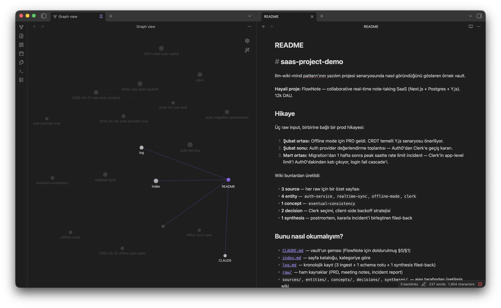
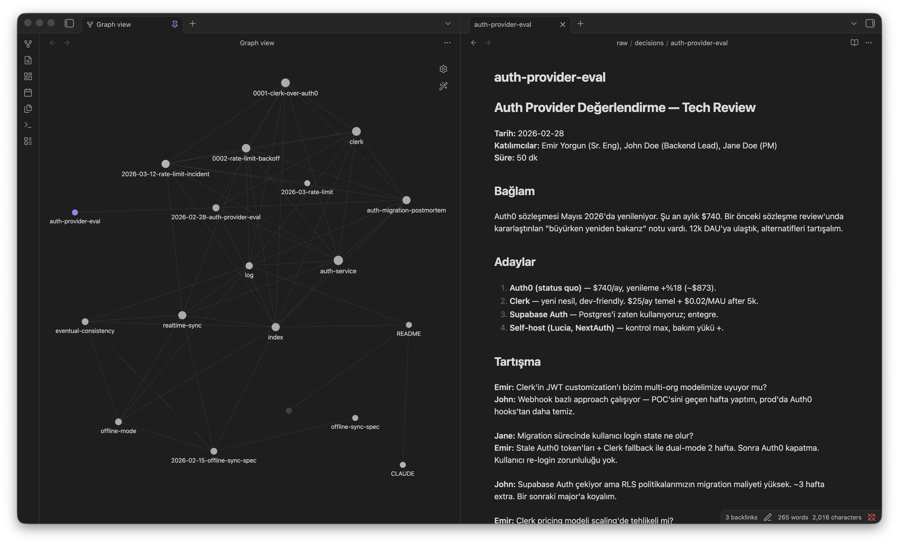

# llm-wiki-mind

[](LICENSE)
[](https://claude.com/claude-code)
[](https://obsidian.md)

> LLM ajanının sürekli inşa ettiği kalıcı, birikimli bir Obsidian bilgi arşivi (persistent wiki) için **starter template + init script + Claude Code skill'leri**.

Sen kaynak bulursun, Claude bookkeeping'i yapar: özetler, çapraz-referansları kurar, çelişkileri işaretler, sentez yazar. Wiki zamanla büyür ve her yeni soru daha zenginleşmiş bir bilgi katmanıyla karşılanır.

**Rol dağılımı**

| Sen | Claude |
|---|---|
| Kaynak bulur (`raw/` altına kor) | Okur, özetler, dosyalar |
| Hangi soruları soracağını belirler | Çapraz-referansları korur |
| Analizi yönlendirir | Çelişkileri işaretler |
| Sonuçları okur, eleştirel düşünür | Bookkeeping'i yapar |
| Şemayı evriltir | Şemaya uyar |

**Obsidian = IDE, LLM = programmer, wiki = kod tabanı.**

---


*FlowNote demo vault — Graph view ve overview README, Obsidian'da.*


*Aynı vault — auth provider eval meeting (raw) ve graph view yan yana.*

---

## Hızlı başlangıç

### Seçenek A — Claude Code skill ile (önerilen)

```bash
bash <(curl -fsSL https://raw.githubusercontent.com/Hootbu/llm-wiki-mind/main/scripts/install-skills.sh)
```

Skill'leri `~/.claude/skills/` altına bir kerede kurar; mevcut skill varsa yedekler.

Sonra herhangi bir Claude Code oturumunda:

```
/vault-init
```

Claude proje yolu ve vault yolunu soracak, gerisini halledecek.

### Seçenek B — Script doğrudan

```bash
curl -fsSL https://raw.githubusercontent.com/Hootbu/llm-wiki-mind/main/scripts/init-vault.sh \
  -o /tmp/init-vault.sh && chmod +x /tmp/init-vault.sh
/tmp/init-vault.sh ~/Projects/MyApp ~/Desktop/MyApp-Mind/MyApp
```

İki argüman:
1. **PROJECT_PATH** — referans proje dizini (yoksa `-`)
2. **VAULT_PATH** — kurulacak vault'un yeri

Script sorular sorarak ilerler: proje kök `CLAUDE.md` işaretçisi git'e dahil mi, `.gitignore` mı, yoksa atla mı?

Offline / yerel template için:
```bash
./init-vault.sh <proj> <vault> --local ~/Desktop/llm-wiki-mind
```

**Preset ile alanı baştan belirle** — CLAUDE.md §0/§1, `index.md` kategorileri ve `raw/` alt klasörleri otomatik dolar:
```bash
./init-vault.sh <proj> <vault> --preset software
```
Mevcut preset'ler: `software`, `research`, `book-reading`, `journal`. Yeni eklemek için `presets/` klasörüne bak.

---

## Skill'ler ne işe yarar?

### `/vault-init` — yeni vault kur

Yeni bir projeye (veya salt bilgi alanına — kitap okuma, araştırma, günlük) vault kurar. Sorular: proje yolu, vault yolu. Template'i GitHub'dan çeker, yerine yerleştirir, `CLAUDE.md`'deki yolları günceller, projenin kök `CLAUDE.md`'sine **vault işaretçisi** ekler (böylece Claude o projede her oturumda vault'u otomatik tanır).

### `/vault-sync` — değişiklikleri vault'a sindir

Projede commit yaptın mı? Bu skill `git log` + `git diff` okur, commit özetini `raw/pr-discussions/` altına düşer ve vault'un ingest workflow'unu çalıştırır:

- Etkilenen entity/feature/service sayfalarını günceller.
- Yeni feature eklendiyse yeni entity sayfası yaratır.
- Önemli kararlar `decisions/NNNN-*.md` olarak dosyalanır.
- Çelişki çıkarsa silmez — `⚠ Çelişki` notu bırakır.
- `index.md` ve `log.md` senkronize.

Aralık esnek: son commit, belirli hash, tarih aralığı, ya da tüm bir PR (`main..HEAD`).

### `/vault-lint` — sağlık kontrolü

Wiki büyüdükçe bozulur. Bu skill şunları tarar:

- **Çelişkiler** — `⚠ Çelişki` notları, çözüm önerileri.
- **Stale claim'ler** — 90+ gün güncellenmemiş `active` sayfalar; re-ingest önerisi.
- **Orphan sayfalar** — hiç link almayanlar; link ekle veya archive'a taşı.
- **Broken link'ler** — `[[linklenmiş]]` ama dosyası olmayanlar; stub oluştur veya kaldır.
- **Tek-yönlü referanslar** — A→B var ama B→A yok; `## İlgili` ekle.
- **Veri boşlukları** — placeholder'lar; web araması / raw ekleme önerisi.
- **Yeni soru önerileri** — wiki'deki kalıplara bakarak araştırmaya değer 3-5 soru.

Çıktı: tek markdown rapor + otomatik düzeltilebilir değişiklikler kullanıcı onayıyla uygulanır.

---

## Vault nasıl çalışır? (kısa pattern özeti)

### Üç katman

1. **`raw/`** — ham kaynaklar. **Immutable** (sadece sen eklersin, ajan yazmaz).
2. **Wiki** (vault root) — `sources/`, `entities/`, `concepts/`, `decisions/`, `syntheses/`. LLM burayı tamamen yönetir.
3. **`CLAUDE.md`** — şema / anayasa. Her oturumda ilk okunan dosya; klasör yapısını, isimlendirmeyi, workflow'ları, yasakları tanımlar. Sen ve ajan zamanla evriltirsiniz.

### Üç operasyon

- **INGEST** — yeni kaynağı `raw/` altına koy, "ingest et" de. Ajan: okur → source özeti yazar → entity/concept sayfalarını günceller → çelişki varsa işaretler → `index.md` + `log.md` günceller.
- **QUERY** — soru sor. Ajan: `index.md`'yi tarar → ilgili sayfaları açar → sentez üretir → değerli cevapları `syntheses/` altına **filed-back** eder (atomic sayfa olarak).
- **LINT** — periyodik sağlık kontrolü (yukarıda).

### Neden çalışır?

Wiki bakımının zor kısmı düşünmek değil — **bookkeeping**'tir. Çapraz-referanslar, stale özetler, çelişki yakalama, onlarca sayfa arasında tutarlılık. LLM sıkılmaz, unutmaz, tek pass'te 15 dosyaya dokunur. **Wiki bakımlı kalır çünkü bakımın maliyeti neredeyse sıfırdır.**

---

## Örnekler

Pattern'in somut bir vault'ta nasıl göründüğünü görmek için:

- [`examples/saas-project-demo/`](examples/saas-project-demo/) — hayali bir SaaS projesi (FlowNote). Üç raw input (PRD, auth provider eval meeting, prod incident report) ve bunlardan üreyen tam wiki: 4 entity, 1 concept, 2 decision, 1 synthesis. Hikaye: bir auth migration kararı + 1 hafta sonra rate limit incident → kararla incident'i birleştiren filed-back postmortem. Yazılımcılar için pattern'in en somut görünümü.

Önce `examples/saas-project-demo/raw/decisions/auth-provider-eval.md` → sonra `raw/incidents/2026-03-rate-limit.md` → en sonunda `syntheses/auth-migration-postmortem.md` okumayı dene; pattern'in **kararla bir hafta sonraki olayı bağlama** yeteneğini görürsün.

---

## Tipik bir gün

Vault'la çalışmak günlük bir akışa oturur. Örnek bir hafta:

- **Pazartesi** — Yeni bir toplantı transkriptini `raw/meetings/` altına atarsın. `/vault-sync` dersin. Claude transcript'i okur, `sources/` altına özet yazar, geçen entity/concept sayfalarını günceller, çelişki varsa işaretler.
- **Çarşamba** — Projede birkaç commit attın. `/vault-sync` dersin. Skill `log.md`'den son ingest commit'ini otomatik tespit eder, aradaki yeni commit'leri ingest eder; etkilenen entity sayfaları güncellenir, gerekirse `decisions/` altına yeni karar dosyası açılır.
- **Cuma** — Bir soru sorarsın ("auth migration'dan sonra rate limit incident'i ne öğretti?"). Claude `index.md`'yi tarar, ilgili decision + incident sayfalarını okur, sentez verir; değerli olanı `syntheses/` altına filed-back eder.
- **Ay sonu** — `/vault-lint` ile sağlık kontrolü çalıştırırsın: çelişkiler, stale claim'ler, orphan sayfalar, broken link'ler. Rapor + onayınla otomatik düzeltmeler.

Sen kaynak ve soru üretirsin; bookkeeping arka planda kendini toplar.

---

## Kullanım alanları

- **Yazılım projesi**: mimari kararlar, sprint planları, toplantılar, PR tartışmaları, incident'ler, harici servis davranışları, maliyet/performans analizleri.
- **Araştırma**: makaleler, teoriler, metodoloji notları, deney kayıtları, evrilen tez.
- **Kitap okuma**: bölüm bölüm dosyala — karakterler, temalar, bağlantılar. Kişisel bir Gateway.
- **Kişisel gelişim / günlük**: hedefler, sağlık, okuma notları, kendi hakkında yapılandırılmış resim.
- **Takım bilgisi**: Slack thread'leri, toplantı transkriptleri, müşteri görüşmeleri. Kimsenin yapmak istemediği bookkeeping.
- **Rakip analizi, due diligence, ders notları, hobi araştırması** — zamanla bilgi biriktirmek istediğin her şey.

---

## Repo yapısı

```
llm-wiki-mind/
├── README.md                    # bu dosya
├── LICENSE                      # MIT
├── template/                    # /vault-init bunu kopyalar
│   ├── CLAUDE.md                # şema (anayasa) — <VAULT_PATH>/<PROJECT_PATH> placeholder
│   ├── README.md                # vault'un kendi README'i
│   ├── index.md                 # kategori iskelet
│   ├── log.md                   # zamansal kayıt iskelet
│   ├── raw/                     # (boş, .gitkeep)
│   ├── sources/
│   ├── entities/
│   ├── concepts/
│   ├── decisions/
│   ├── syntheses/
│   └── archive/
├── examples/                    # somut, doldurulmuş örnek vault'lar
│   └── saas-project-demo/       # hayali SaaS projesi — 17 dosya, tam hikaye
├── scripts/
│   └── init-vault.sh            # bash kurucu
└── skills/
    ├── vault-init/SKILL.md
    ├── vault-sync/SKILL.md
    └── vault-lint/SKILL.md
```

---

## Teşekkürler

Bu proje [selmakcby/knowledge-pipeline](https://github.com/selmakcby/knowledge-pipeline) reposundaki **Selma Akçebay**'ın yazdığı `llm-wiki` SKILL.md pattern'ından ilham alıyor. Desen özgün olarak ona aittir; bu repo o deseni Türkçe, Obsidian odaklı, "starter + skill" paketlemesi olarak sunar.

Pattern ruhen Vannevar Bush'un 1945'teki **Memex** vizyonuna yakındır — kişisel, aktif olarak küratörlenmiş bilgi deposu, belgeler arasında çağrışımsal izler. Bush'un çözemediği tek şey kimin bakımı yapacağıydı. LLM o kısmı halleder.

Kurulum ve dokümantasyon yardımı: Claude (Anthropic).

---

## SSS

**Notion / Logseq / Tana yerine niye bu?**
Onlar editör — sayfayı sen yazarsın, bağlantıyı sen kurarsın. Bu pattern LLM-bookkeeping'i merkeze koyuyor: markdown'lar ham ve taşınabilir, çapraz-referans/özet/çelişki bakımını Claude yapıyor. Tool değil, bir akış.

**Claude Code şart mı? GPT / Cursor / başka model çalışır mı?**
Skill'ler (`/vault-init`, `/vault-sync`, `/vault-lint`) Claude Code'a özel — slash command, AskUserQuestion gibi mekanizmaları kullanıyor. Ama pattern'in kendisi (CLAUDE.md şeması, raw/sources/entities yapısı, üç operasyon) model-agnostik; başka asistanla manuel olarak aynı akışı kurabilirsin.

**Maliyet ne kadar?**
Küçük vault'larda günde birkaç ingest = düşük token harcaması. Büyük vault'larda Claude'un prompt caching'i devreye giriyor, ingest başına maliyet düşüyor. Anthropic API doğrudan kullanımıyla tipik kişisel kullanım $5-20/ay aralığında; Claude Code aboneliği üzerinden kullanılırsa abonelik kapsamında.

**Veri nerede tutulur, privacy?**
Vault tamamen yerel — markdown dosyaları diskinde, başka yere gitmiyor. Sadece konuşma sırasında Claude'a verdiğin / okuttuğun ilgili sayfalar Anthropic'e gidiyor. Vault'un tamamı sürekli upload edilmiyor.

**Vault'umu git'e push edebilir miyim?**
Evet. `init-vault.sh` vault'u zaten `git init`'liyor, istersen GitHub'a push edebilirsin. Public bir repo'ya push'tan önce `raw/` altına koyduğun gizli içeriklere (API key, kişisel bilgi, müşteri görüşmesi) dikkat et — bunları `.gitignore`'a manuel eklemen gerekir.

---

## Lisans

MIT — detay için [LICENSE](LICENSE).
